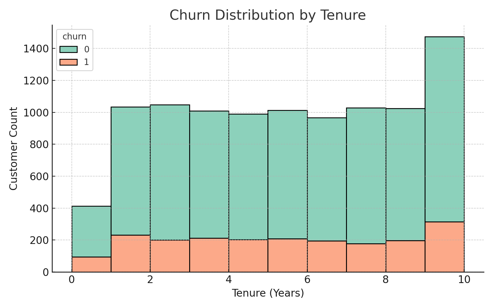
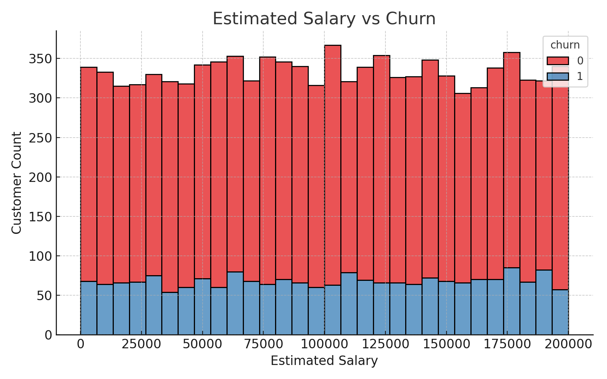
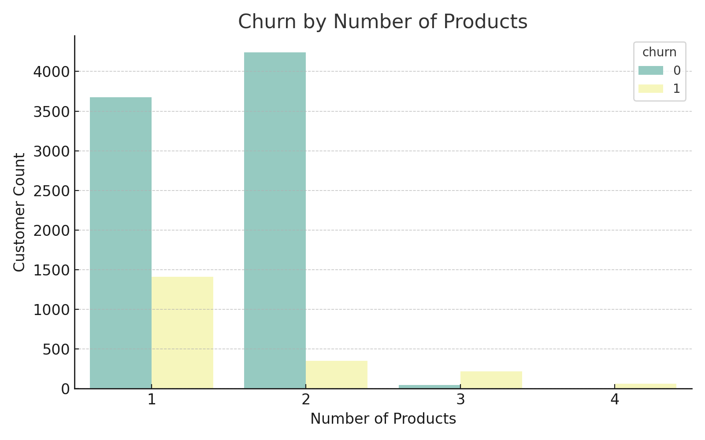

# 🏦 Banking Customer Retention Analysis

<p align="center">
  
</p>

Understand what drives customer churn in the banking sector using Python and Power BI. This project combines visual exploration, business interpretation, and dashboard storytelling to guide data-driven retention strategies.

---

## 🎯 Business Objective

- Identify key factors contributing to customer churn.
- Visualize churn patterns by tenure, product ownership, and estimated salary.
- Present insights interactively via a Power BI dashboard.
- Provide actionable recommendations to improve customer retention.

---

## 📁 Project Structure

```
Banking-Customer-Retention-Analysis/
├── README.md
├── data/
│   └── bank_customer_data.csv
├── visuals/
│   ├── churn_by_tenure.png
│   ├── salary_vs_churn.png
│   └── products_vs_churn.png
├── powerbi/
│   └── Bank_Customer_Retention_Report.pbix
└── Banking_Retention_Analysis_Notebook.ipynb
```

---

## 📊 Exploratory Data Analysis (Python)





See full code and insights in the notebook:

📓 [`Banking_Retention_Analysis_Notebook.ipynb`](Banking_Retention_Analysis_Notebook.ipynb)

---

## 📄 Dataset

- 📁 [`data/bank_customer_data.csv`](data/bank_customer_data.csv)
- Source: Simulated banking records
- Features: Age, Balance, Tenure, Products, Active Status, Estimated Salary, Churn

---

## 📊 Power BI Dashboard

An interactive dashboard offering insights into churn patterns, product use, and retention strategies.

📁 [Download Power BI Dashboard](powerbi/Bank_Customer_Retention_Report.pbix)

---

## 🛠 Tools Used

- Python (Pandas, Matplotlib, Seaborn)
- Power BI
- Jupyter Notebook
- VS Code

---

## 📌 Key Insights

- Customers with shorter tenure are more likely to churn.
- Higher product engagement correlates with lower churn rates.
- Churn distribution varies by income, though less drastically.

---

## 📃 License

MIT License. See `LICENSE` file for details.
